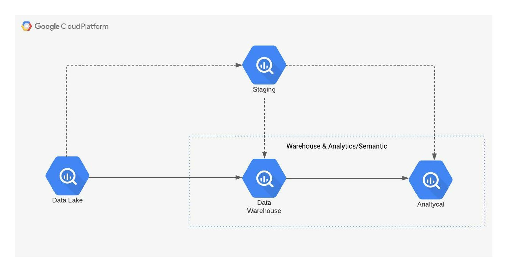
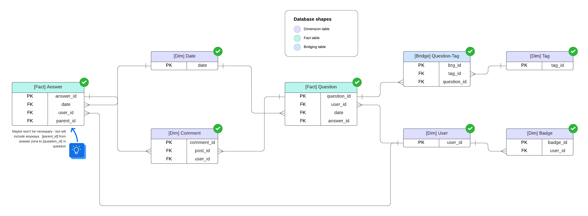
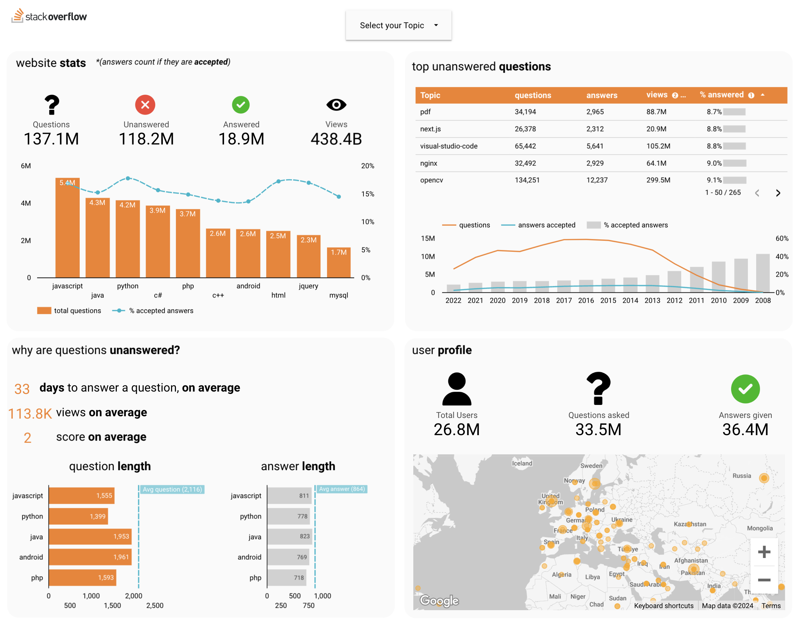

# **STACKOVERFLOW PIPELINE**
A data pipeline created for Rittman Analytics that will process stackoverflow data available via GCP [public datasets](https://cloud.google.com/blog/products/gcp/google-bigquery-public-datasets-now-include-stack-overflow-q-a).
Trial is found within this [repo](https://github.com/rittmananalytics/analytics_engineer_trial).

All links and information can either be found within this README, or on [these slides](https://docs.google.com/presentation/d/1z_woWHHGaGCnXDoDzcUufNwLIwtvzqbUx6LgSCg2AdA/edit#slide=id.g1f8bdc63c97_0_0).

## Using dbt & Developer Ways of Working
- Use of virtual environments is recommended, especially if you work on multiple client/internal projects requiring conflicting dbt or Python versions
- Set up your local profiles.yml and add it to your .dbt/profiles.yml file, you may need to direct dbt to this new path:  
 ``` $ export DBT_PROFILES_DIR=path/to/directory``` & ```$ export DBT_PROJECT_DIR=path/to/directory```.
- If running dbt from the command line, you will need to navigate ```cd folder/filepath``` into the stackoverflow_pipeline folder. 
- Run dbt debug to check your project setup and authentication is correct
- profiles.yml has 2 targets, **dev** & **prod**, and by default is set to dev
- Run the command ```./run``` for ease; this script runs ```dbt compile```, ```dbt run``` & ```dbt docs``` with 1 simple command.


## Tagging and Labelling

In general detailed tags and labels to the resources generated by dbt, to assist with data discovery as well as enforcing [Data Protection Approach], for the purposes of this exercise, only basic tags have been added.

**dbt tags** are also applied via the dbt_project.yml file to enable targeted execution of the various layers and domains. See Folder Structure (below).

## Folder structure

The folder structure used in this dbt project is aligned to general best practices with a number of layers, a staging (ephemeral) layer,  warehouse (table) layer, analytics (table) layer and semantics (view) layer.  Depending on the tool, the final layer may not be necessary but have been added as Looker Data Studio has minimal modelling capabilites. 

The structure is separated into distinct layers of transformation:
- Staging
- Warehouse
- Analytics
- Semantics

Each of these is defined in the ***dbt_project.yml*** file, along with tags to enable targeted execution of a specific domain, transformation layer, or combination of the two.


## Data structure

The data structure within the warehouse layer is generally agnostic, and for the analytics layer follows a snowflake dim/fact schema (with conformed dimensions).  ***Please note, not all tables have been modelled, in the interest of time, modelling has been limited to relevant tables***  

- Full ERD diagram can be found [here](https://lucid.app/lucidchart/bca77f31-3eac-44b2-a93f-29b5fb831bab/edit?viewport_loc=66%2C375%2C2607%2C1422%2C0_0&invitationId=inv_73b3d199-5478-493a-9019-4c9a049c13f4)
- summarised version below:



## Dashboard

Found here: [Looker Data Studio Dashboard](https://lookerstudio.google.com/u/0/reporting/5cdffd8c-55c9-4779-acfc-cbaa73ac9bdb/page/tLuTE/edit)



## SQLFluff

SQLFluff is used for linting and checking of code quality.  It is recommended to install and run SQLFluff locally prior to commiting your code to accelerate the development process. The rules enforced by SQLFluff can be found in the .sqlfluff file.

**Note:** when running SQLFluff from the command line, you must run it from the root. This ensures that the rules applied in the .sqlfluff file are selected rather than the default rules.  


## Other notes

- Analysis, Dashboard and modelling are not exhaustive.  As such there were a number of tasks that needed to be done:
- Data tests
- Incremental loads
- Text analysis of questions & answers (grammer / question quality)
- Analysis of "unaccepted" answers
- different approaches to data modelling have not been considered (i.e. OBT)
